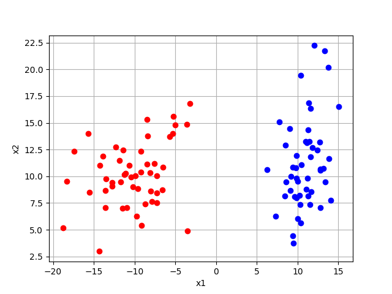
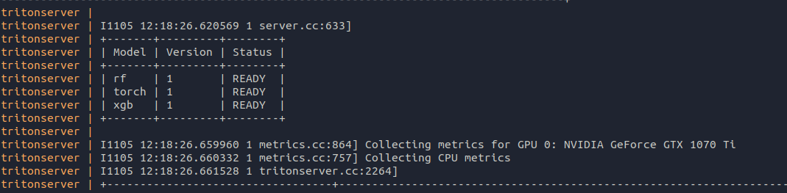

### Примаер сервиса классификации с FastAPI и Triton Inference Server

#### Суть примера
В данном репозитоии представлен сервис, где модели и сервис с бизнес-логикой разнесены по разным сервисам.
Преимущества такого подхода:
* Модели можно обновлять на лету, не останавливая сервис
* Физически, сервис с моделями может находиться на другой машине, имещюей гораздо больше вычислительных ресурсов
* Triton Inference Server берет на себя работу по балансированию нагрузки
* Основной сервис никак не зависит от моделей и не нуждается в множестве зависимостей, необходимых для работы модели

#### Данные и модели
В скрипте train_model.py генерируются и обучаются три модели: pytorch, sklearn и xgboost. Модели 
решают простую задачу классификации на данных, представленных на изображении ниже


Обученные модели не используются в приложении, а деплоятся в отдельном сервисе - Triton Inference Server.
Подробнее см. по [ссылке](https://github.com/triton-inference-server/server). Тритон из коробки поддерживаем множество фреймворков,
однако, если требуется задеплоить модели LightGBM, XGBoost или Scikit-Learn, придется проделать дополнительные шаги.
Все эти шаги описаны [здесь](https://github.com/triton-inference-server/fil_backend). Образ, который получится после выполнения ```./build```
будет поддерживать FIL backend и позволяет деплоить вышеперечисленные моедли. 

Если обучить модели заново, то для sklearn модели необходима дополнительная конвертация
```
./convert_sklearn.sh models/rf/1/model.pkl 
```

#### Шаги для запуска репозитория:
* Установить Docker. Инструкция на [оф.сайте](https://docs.docker.com/engine/install/ubuntu/)
* Установить nvidia-docker2. [Инстуркция по установке](https://docs.nvidia.com/datacenter/cloud-native/container-toolkit/install-guide.html)
* Скачать FIL-backend. Следовать инструкции в разделе Installation на [странице](https://github.com/triton-inference-server/fil_backend).
После выполнения (довольно долгого), проверить, что появился образ triton_fil. Сделать это можно командой ```docker images```.
* В корневой директории этого проекта выполнить ```docker-compose build```. Эта команда выполнит сборку всех описанных сервисов в файле docker-compose.yml.
* Если всё успешно, можем запускать сервис ```docker-compose up -d```

ЗАМЕЧАНИЕ!!!
Если требуется задеплоить, например pytorch модель, шаги с FIL-backend выполнять не нужно. Достаточно использовать образ tritonserver.
Скачать  ```docker pull nvcr.io/nvidia/tritonserver:22.09-py3``` и в дальнейшем использовать вместо образа triton_fil.

Логи каждого сервиса можно посмотреть выполнив ```docker-compose logs triton``` или ```docker-compose logs app```.
Если модели успешно поднялись, в логе triton сервиса должно быть сообщение, что модели запущены:  


#### Тестирование моделей
По адресу http://0.0.0.0:8000/docs можно зайти и протестировать работу моделей.
